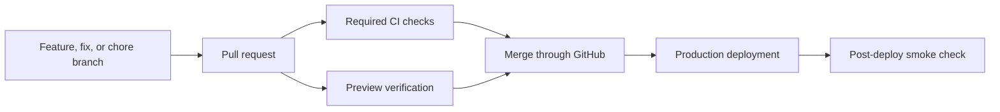

# Delivery Workflow

> This is the plain-language map for getting changes from a local branch into production.
> `/workflow-init` replaces the placeholders below with the project's actual commands and connected services.

## What the terms mean

- **Continuous integration (CI)** runs repeatable checks on every pull request before code can merge.
- **Continuous delivery/deployment (CD)** builds and deploys accepted changes from the default branch.
- **Branch protection** makes GitHub enforce the workflow instead of relying on memory.
- **Preview deployment** is a temporary environment for reviewing a pull request before it reaches production.
- **Smoke test** is a small end-to-end check that proves the deployed application starts and its most important route or workflow responds.

CI lowers the chance of shipping preventable mistakes.
It does not replace product judgment, security review, migration planning, or hands-on verification for risky changes.

## Delivery path

1. Update the remote default branch and create a focused feature, fix, or chore branch.
2. Implement the smallest complete change and verify the affected behavior locally.
3. Open a pull request with the original intent, changes, verification evidence, and remaining risk.
4. Let required CI checks and any deployment preview finish.
5. Fix failures on the branch. Do not bypass required checks or use an administrator override.
6. Merge through GitHub after the change and evidence are acceptable.
7. Confirm the exact merged commit reaches production and run the configured smoke check.

## Required checks

`/workflow-init` must replace this table with commands that exist in the repository.
Do not leave fictional commands in this document or CI.

| Gate | Command | What it proves |
|---|---|---|
| Install | `{{install command}}` | The lockfile produces a reproducible dependency tree. |
| Format | `{{format check command or not configured}}` | Tracked source matches the formatter. |
| Types | `{{typecheck command or not configured}}` | Static type checks pass. |
| Lint | `{{lint command or not configured}}` | Configured code-quality rules pass. |
| Unit/integration tests | `{{test command or not configured}}` | Shared logic and contracts still behave as expected. |
| Build | `{{build command or not configured}}` | The production artifact compiles. |
| Browser behavior | `{{browser test command or not configured}}` | The most important user path works in a real browser. |
| Dependency audit | `{{audit command or not configured}}` | Known production dependency vulnerabilities are reviewed. |

## Repository policy

- Work on a non-default branch. Do not implement directly on `main` or the repository's equivalent default branch.
- Merge through a pull request. Do not merge the branch locally and push the default branch.
- Require the stable CI job named `Quality` before merge when GitHub branch protection is enabled.
- Require the pull request branch to be current with the default branch.
- Require review conversations to be resolved.
- Block force pushes and branch deletion on the default branch.
- For a solo-maintained repository, zero mandatory human approvals is acceptable. CI and branch protection still apply.
- Do not require third-party checks that appear inconsistently. A flaky provider check can lock every pull request.

## Deployment and rollback

| Area | Project setting |
|---|---|
| Preview provider | `{{provider or not configured}}` |
| Production provider | `{{provider or not configured}}` |
| Production URL | `{{URL or not configured}}` |
| Post-merge smoke | `{{configured command/workflow or not configured}}` |
| Rollback path | `{{provider rollback command/process or document before launch}}` |

For database migrations, authentication, permissions, billing, tenant boundaries, or destructive data changes, add a change-specific migration and rollback plan to the pull request.

## Automation status

| Automation | Status |
|---|---|
| Pull-request CI | `{{configured | planned | skipped}}` |
| Browser behavior test | `{{configured | planned | not applicable}}` |
| Pull-request template | `{{configured | planned | skipped}}` |
| Dependency updates | `{{configured | planned | skipped}}` |
| Protected default branch | `{{configured | pending first successful CI run | planned | skipped}}` |
| Deployment previews | `{{configured | planned | not applicable}}` |
| Production smoke check | `{{configured | planned | not applicable}}` |
| GitHub Project | `{{linked project | planned | skipped}}` |

## When a check fails

1. Read the failing step and reproduce it locally when possible.
2. Fix the root cause on the feature branch.
3. Push the branch and let the same check rerun.
4. If a pre-existing failure blocks delivery, document the evidence and decide explicitly whether to repair it in scope or track it separately.
5. Never report delivery as complete while a required check, deployment, or post-merge smoke test is still failing.
